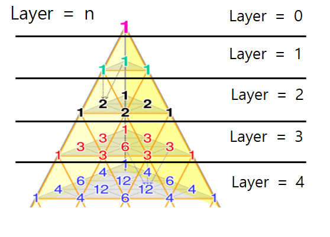
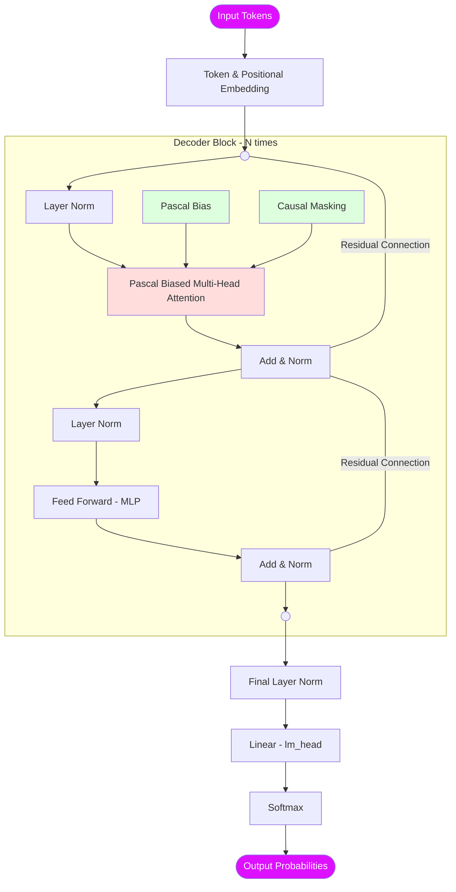
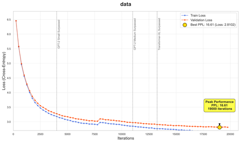

# Pascal Biased Attention (PBA)

[](LICENSE)


Pascal Biased Attention is a novel attention mechanism designed to maximize the training efficiency of Transformer models. By injecting the mathematical structure of the **Pascal Pyramid** as a bias, the project aims to reduce parameter counts and accelerate training while maintaining high performance.

---

## 📌 Project Overview

Modern language models face significant sustainability challenges due to high power consumption and carbon emissions. This project implements **Sustainable AI** by applying the Pascal Pyramid structure to the attention mechanism.

Unlike standard attention, which assigns uniform initial conditions to all token pairs, we introduce **Structural Bias** based on trinomial coefficients. This guides the model to learn structural relationships more effectively, significantly reducing the iterations needed for convergence.

### Key Features
- **Pascal Pyramid Bias**: Utilizes trinomial coefficients $(x+y+z)^n$ to mathematically model the relationships and interaction probabilities between tokens.
- **Adaptive Bias Scaling**: A warm-up scheduling system that starts with weak bias and gradually increases it, allowing for stable pattern learning.
- **Skip-Gram Penalty**: Introduces a learnable penalty for distant token pairs to balance local and global context:
  $B'_{i,j} = B_{i,j} \cdot e^{-\exp(\theta)}$
- **Efficient Training**: Achieves competitive Perplexity (PPL) on WikiText-103 with optimized resource consumption.

---

## 📐 Theoretical Background

### Pascal Pyramid & Attention
The Pascal Pyramid represents combinatorial possibilities in 3D space. In this project, it is interpreted as the 'distance' and 'interaction probability' between words in a vector space.



*Figure 1: Illustration of Pascal Pyramid layers (Layer 0–4) representing structural inductive bias.*

The bias for $Layer = n$ is calculated as the product of two binomial coefficients:
$$C(n, r) \times C(r, c)$$
This value is transformed into a log-bias and added to the attention scores before the softmax operation.

---

## 🏗 Model Architecture

The model follows a **Decoder-only Transformer** architecture (GPT-style) but replaces the standard Self-Attention with **Pascal Biased Multi-Head Attention**.

<div align="center" style="max-width: 300px; margin: auto;">



</div>

### Biased Attention Formula
The Pascal biased attention is defined as:
$$\text{Attention}_{pascal}(Q, K, V) = \text{softmax}\left( \frac{QK^T}{\sqrt{d_k}} + \alpha(t) \cdot B'(\theta) \right)V$$

Where:
- $B'(\theta)$ is the Pascal Bias matrix after applying the Skip-Gram penalty.
- $\alpha(t)$ is the adaptive scaling factor at training step $t$.

---

## 🚀 Experiments & Results

### Setup
- **Dataset**: WikiText-103 (95% Train, 5% Valid)
- **Hardware**: A100 GPU (~12.9GB VRAM)
- **Parameters**: 12 Layers, 12 Heads, 768 Embedding Dim, Block Size 256.
- **Training Time**: ~250 mins (20,000 Iterations)

### Performance
The model demonstrates efficient convergence on WikiText-103, reaching a competitive Perplexity (PPL) while maintaining resource efficiency.

- **Validation Loss**: 2.8102
- **Perplexity (PPL)**: 16.61
- **LAMBADA Accuracy**: 72.81%



*Figure 3: Training and Validation loss curves showing steady convergence.*

---

## 💻 Installation & Usage

### Dependencies
```bash
pip install -r requirements.txt
```

### Configuration
Hyperparameters can be adjusted in `config.py` or directly in the configuration dataclasses:
```python
# Model Configuration Example
block_size = 256
n_layer = 12
n_head = 12
n_embd = 768
pascal_n = 3  # Order of the Pascal Pyramid
```

### Training
To start training:
```bash
python train.py
```

---

## 📂 Project Structure
```text
.
├── checkpoint/              # Model checkpoints (.pt)
├── config/
│   └── config.py            # Global configuration (Model/Train/Data)
├── data/                    # Dataset storage and meta-data
├── src/
│   ├── dataset.py           # Data preparation and tokenization
│   └── model.py             # Pascal Biased Attention implementation
├── utils/
│   ├── check_ckpt.py        # Checkpoint validation utility
├── generate.py              # Text generation script
├── LICENSE                  # MIT License
├── requirements.txt         # Dependencies
├── train.py                 # Main training loop
└── README.md                # Project documentation
```

---

## 🗺️ Future Work
- Generalization testing across diverse domains beyond WikiText-103.
- In-depth analysis of optimal Pascal parameters $(n)$ and their linguistic correlations.
- Scaling to larger model sizes and multi-GPU environments.

## 👨‍💻 Developer

<div align="center">
  <h3>JuHo Min</h3>
  <p><i>Student & Developer</i></p>

  [](mailto:juhomin16@gmail.com)
  [](https://github.com/lenftk)
</div>

## 📜 License
This project is licensed under the MIT License - see the [LICENSE](LICENSE) file for details.